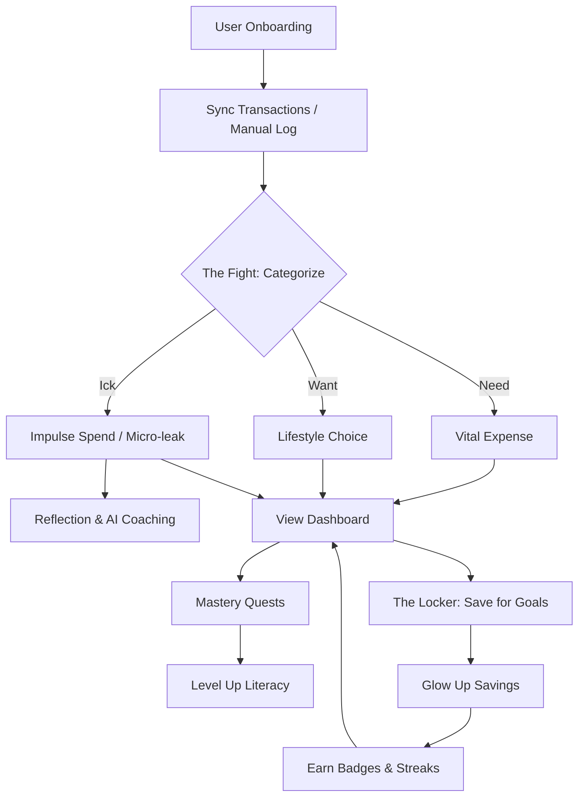

# 💸 Pocket Fund: The Financial Glow-Up 🚀

[](https://reactjs.org/)
[](https://nodejs.org/)
[](https://orm.drizzle.team/)
[](https://openrouter.ai/)

> **"Finance doesn't have to be a drag. Level up your wealth, crush your goals, and master 'The Fight' against impulse spends."**

---

## 🌟 The Vision

Most financial apps are either too complex (filled with boring charts) or too passive. **Pocket Fund** reframes financial management as a **Dynamic RPG (Role-Playing Game)**. We target the two primary hurdles for young adults:

1.  **The Impulse Trap:** "Micro-leaks" (fancy coffees, unused subscriptions) that drain wealth silently.
2.  **The Literacy Gap:** Dense advice leading to "analysis paralysis."

---

## 🧠 Tech Deep Dive: Why we built it this way

### 📁 The Database (The Memory)
A **Database** is the permanent memory of our app. While variables in code disappear when you close the app, the database stays. We use **PostgreSQL** to securely store your:
- User profiles and vault settings.
- Every single transaction in "The Fight".
- Your progress in Quests and "The Locker" (Goals).

### 🍦 Drizzle ORM (The Bridge)
**Drizzle ORM** is the translator between our TypeScript code and the database. 
- **Why it's cool:** It gives us "Type-Safety"—meaning we catch database errors while writing code, not when the user is trying to save money. 
- **Performance:** It is the fastest growing ORM because it is lightweight and lets us write "SQL-like" code with zero overhead.

### 🤖 AI Financial Coach (OpenRouter)
Instead of relying on a single AI model, we use **OpenRouter**. 
- It acts as a gateway to multiple world-class models (Meta Llama 3, Google Gemma, Mistral, etc.).
- **Dynamic Failover:** If one model is busy, we automatically switch to another to ensure your "Glow-Up Coach" is always online.

---

## 🛠 Features Breakdown

### 🥊 The Fight (Categorize & Conquer)
Turn your expense log into a battleground. Categorize every spend to see where your money *really* goes:
-   **Needs:** The Vitals (Rent, Groceries).
-   **Wants:** Lifestyle Choices (Dining out, Hobby).
-   **Icks:** The Impulse Trap. Micro-leaks that you're trying to eliminate.

### 🔒 The Locker (Savings Vault)
"Glow Up" your savings by moving real balance into specific goals. 
-   **Main Goal:** Your "North Star" financial objective.
-   **Mini-Goals:** Small victories that build momentum.

### 🏁 Mastery Quests
Level up your financial literacy through story-based quests instead of dry articles.
-   Earn points for completion.
-   Unlock badges like "Impulse Slayer" or "Budget Boss".
-   Track daily and weekly streaks (Save Streaks & Fight Streaks).

---

## 📐 System Architecture

### 🚄 Technology Stack
- **Frontend**: `React` + `Vite` + `TypeScript`
- **Styling**: `Tailwind CSS` + `Framer Motion` (Animations) + `Shadcn UI` (Components)
- **Backend**: `Express` (Node.js)
- **Database**: `Neon (PostgreSQL)` with `Drizzle ORM`
- **Auth**: `Google OAuth`
- **AI**: `OpenRouter API` (Llama/Gemma Fallback System)

### 🗺 User Journey Flow


---

## 🚀 Getting Started

### Prerequisites
- Node.js (v18+)
- PostgreSQL Database (Recommend Neon.tech)
- Google Cloud Console Project (for Auth)
- OpenRouter API Key

### Installation

1. **Clone the repository**
   ```bash
   git clone https://github.com/your-username/Pocket-Fund.git
   cd Pocket-Fund
   ```

2. **Install dependencies**
   ```bash
   npm install
   ```

3. **Environment Configuration**
   Create a `.env` file in the root:
   ```env
   DATABASE_URL=your_postgres_url
   GOOGLE_CLIENT_ID=your_google_id
   GOOGLE_CLIENT_SECRET=your_google_secret
   OPENROUTER_API_KEY=your_openrouter_key
   SESSION_SECRET=a_random_secret_string
   ```

4. **Initialize Database**
   ```bash
   npm run db:push
   ```

5. **Launch Application**
   ```bash
   npm run dev
   ```

---

## 📜 License
Distributed under the MIT License. See `LICENSE` for more information.

---

<p align="center">
  Built with ❤️ for a better financial future.
</p>
